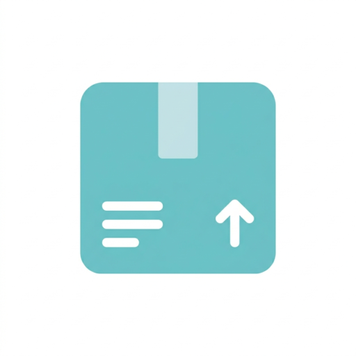

# OpenLoader



Install APKs on the phone you own. Google is introducing [Android developer verification](https://developer.android.com/developer-verification): on many devices, installs will increasingly expect apps from verified, registered developers. OpenLoader helps you sideload APKs you already have, including several in one go, using wireless ADB (Android 11+) and optional Shizuku (privileged install when the Shizuku companion has granted access). Your device, your choice.

The UI uses Jetpack Compose and Material 3: install queue, install history, and Material You-style theming.

## Google Play

<a href="https://play.google.com/store/apps/details?id=org.thebytearray.app.android.openloader"></a>

Some capabilities:

- Queue multiple APKs and run installs in sequence
- Install history stored locally (survives restarts)
- Wireless debugging pairing helpers and connection checks where applicable
- Settings for install method, appearance, and theme

Contents

- [Google Play](#google-play)
- [About this repository](#about-this-repository)
- [Installation](#installation)
- [Building](#building)
- [Project layout](#project-layout)
- [Versioning](#versioning)
- [Contributing](#contributing)
- [Security policy](#security-policy)
- [Signing certificate hash](#signing-certificate-hash)
- [License](#license)
- [Authors](#authors)
- [Acknowledgements](#acknowledgements)
- [Donation](#donation)

## About this repository

This is the source tree for OpenLoader, published by [The Byte Array](https://thebytearray.org). Store or website builds are signed with project release keys. Anything you build locally is signed with your own debug or release keystore. When official signing fingerprints are published, they should match [Signing certificate hash](#signing-certificate-hash) below.

## Installation

These steps get the project building on your machine for development and testing.

Requirements

- Android SDK (via Android Studio or command-line tools)
- JDK 17 or newer
- Git
- Gradle Wrapper included in the repo (`./gradlew`)

Kotlin and the Android Gradle Plugin versions are pinned in [`libs.versions.toml`](gradle/libs.versions.toml).

Dependencies (libraries)

Notable stack pieces:

- Jetpack Compose, Material 3, Navigation
- Hilt for dependency injection
- DataStore and Protocol Buffers (Kotlin lite) for preferences and install history
- Shizuku API for the privileged install path
- [libadb-android](https://github.com/MuntashirAkon/libadb-android) for wireless ADB
- Conscrypt for TLS used with ADB transports
- Material Kolor for dynamic theming
- Kotlin coroutines, kotlinx.serialization

Full versions and modules are declared under `gradle/` and module `build.gradle.kts` files.

## Building

The `:app` module uses `debug` and `release` build types (no product flavors). Typical commands:

```sh
./gradlew :app:assembleDebug
./gradlew :app:assembleRelease
```

Install a debug build on a connected device or emulator:

```sh
./gradlew :app:installDebug
```

Release builds need your own keystore and signing configuration for the channel you use (Play, sideload, or other).

## Project layout

The codebase is split into modules, for example:

| Area | Modules |
|------|---------|
| Application | `:app` |
| Shared UI and design | `:core:designsystem`, `:core:ui` |
| Data and domain | `:core:datastore`, `:core:datastore-proto`, `:core:domain` |
| Install backends | `:core:adb`, `:core:shizuku` |
| Navigation glue | `:core:navigation` |
| Installer feature | `:feature:installer:api`, `:feature:installer:impl` |

## Versioning

Releases follow [Semantic Versioning](https://semver.org) (`Major.Minor.Patch`):

- Major: incompatible user-facing or integration changes
- Minor: new functionality, backward compatible
- Patch: backward compatible fixes

`versionName` and `versionCode` live in [`build.gradle.kts`](app/build.gradle.kts).

## Contributing

See [`CONTRIBUTING.md`](.github/CONTRIBUTING.md). Community expectations are in [`CODE_OF_CONDUCT.md`](CODE_OF_CONDUCT.md).

## Security policy

Report security issues per [`SECURITY.md`](.github/SECURITY.md). Do not disclose undisclosed vulnerabilities in public issues.

## Signing certificate hash

SHA-256 (release signing certificate fingerprint):

```
56 bd 4a 46 a9 14 84 23 d3 65 5d 5d c3 28 97 90 ce 73 67 31 8b 94 d0 c4 c1 18 69 f1 94 b4 4d 24
```

## License

OpenLoader is licensed under the GNU General Public License v3.0. See [`LICENSE`](LICENSE).

## Authors

Contributor names are listed in [`AUTHORS`](AUTHORS).

## Acknowledgements

Third-party libraries and notices are summarized in [`ACKNOWLEDGEMENTS.md`](ACKNOWLEDGEMENTS.md).

## Donation


If you want to support development, you can send Bitcoin (BTC) to:

```
bc1qqcfa36sw8fmn8dvrpvewdmjcn75wc6wuys204m
```

Always verify the address when you copy it. Donations are voluntary and do not buy services or guarantees.
